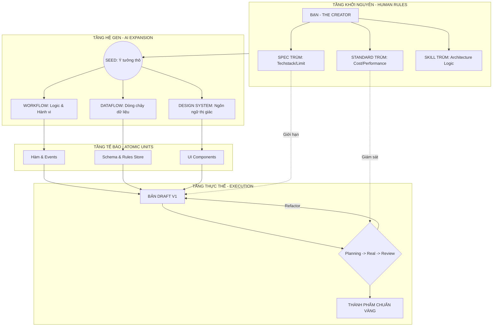
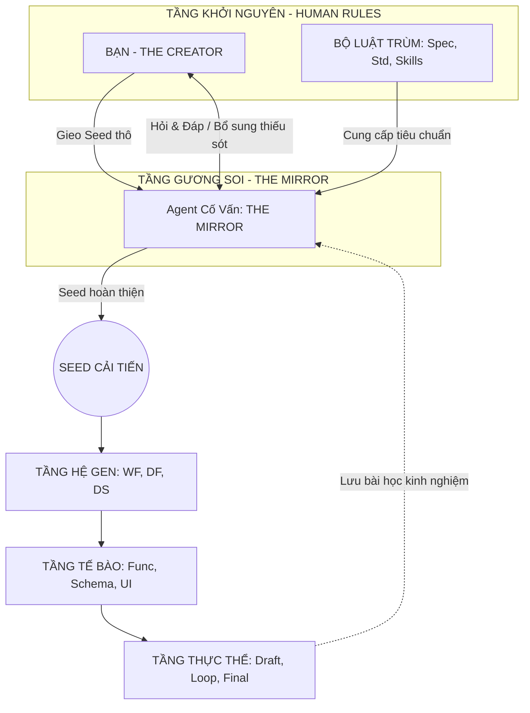
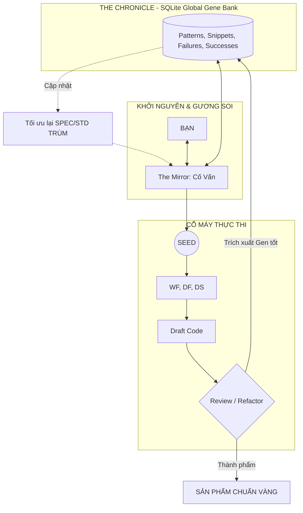

## Quy trình vũ trụ.

```mermaid
graph TD
%% Tầng 0: Khởi Nguyên (Human Only)
subgraph Layer_0 [TẦNG KHỞI NGUYÊN - HUMAN RULES]
God[BẠN - THE CREATOR] --> RootSpec[SPEC TRÙM: Techstack/Limit]
God --> RootStd[STANDARD TRÙM: Cost/Performance]
God --> RootSkill[SKILL TRÙM: Architecture Logic]
end

    %% Tầng 1: Hạt Giống
    Layer_0 --> Seed((SEED: Ý tưởng thô))

    %% Tầng 2: Hệ Gen (DNA Expansion)
    subgraph Layer_2 [TẦNG HỆ GEN - AI EXPANSION]
        Seed --> WF[WORKFLOW: Logic & Hành vi]
        Seed --> DF[DATAFLOW: Dòng chảy dữ liệu]
        Seed --> DS[DESIGN SYSTEM: Ngôn ngữ thị giác]
    end

    %% Tầng 3: Tế Bào (Functional Units)
    subgraph Layer_3 [TẦNG TẾ BÀO - ATOMIC UNITS]
        WF --> Func[Hàm & Events]
        DF --> Schema[Schema & Rules Store]
        DS --> Layout[UI Components]
    end

    %% Tầng 4: Thực Thể (Final Product)
    subgraph Layer_4 [TẦNG THỰC THỂ - EXECUTION]
        Func & Schema & Layout --> Draft[BẢN DRAFT V1]
        Draft --> Loop{Planning -> Real -> Review}
        Loop -->|Refactor| Draft
        Loop --> Final[THÀNH PHẨM CHUẨN VÀNG]
    end

    %% Hệ thống giám sát
    RootStd -.->|Giám sát| Loop
    RootSpec -.->|Giới hạn| Draft
```

## Quy trình cố vấn.

```mermaid
graph TD
    %% Tầng 0: Khởi Nguyên
    subgraph Layer_0 [TẦNG KHỞI NGUYÊN - HUMAN RULES]
        God[BẠN - THE CREATOR]
        Root[BỘ LUẬT TRÙM: Spec, Std, Skills]
    end

    %% Tầng Cố Vấn (MỚI)
    subgraph Layer_Mirror [TẦNG GƯƠNG SOI - THE MIRROR]
        Consultant[Agent Cố Vấn: THE MIRROR]
    end

    %% Luồng tương tác
    God -->|Gieo Seed thô| Consultant
    Root -->|Cung cấp tiêu chuẩn| Consultant
    Consultant <-->|Hỏi & Đáp / Bổ sung thiếu sót| God

    %% Tầng Tiến hóa
    Consultant -->|Seed hoàn thiện| Seed((SEED CẢI TIẾN))

    Seed --> Layer_2[TẦNG HỆ GEN: WF, DF, DS]
    Layer_2 --> Layer_3[TẦNG TẾ BÀO: Func, Schema, UI]
    Layer_3 --> Layer_4[TẦNG THỰC THỂ: Draft, Loop, Final]

    %% Feedback Loop
    Layer_4 -.->|Lưu bài học kinh nghiệm| Consultant
```

## Quy trình tiến hoá.

```mermaid
graph TD
    %% Tầng gốc rễ: Hệ Gen toàn cầu
    subgraph Global_Memory [THE CHRONICLE - SQLite Global Gene Bank]
        KnowledgeBase[(Patterns, Snippets, Failures, Successes)]
    end

    %% Tầng 0 & Mirror (Tương tác)
    subgraph Layer_Prime [KHỞI NGUYÊN & GƯƠNG SOI]
        God[BẠN] <--> Mirror[The Mirror: Cố Vấn]
        Mirror <--> KnowledgeBase
    end

    %% Tầng 1: Hạt Giống
    Mirror --> Seed((SEED))

    %% Tầng thực thi (Tế bào & Thực thể)
    subgraph Execution_Engine [CỖ MÁY THỰC THI]
        Seed --> DNA[WF, DF, DS]
        DNA --> Code[Draft Code]
        Code --> QualityLoop{Review / Refactor}
    end

    %% Tầng Tiến Hóa (QUAN TRỌNG NHẤT)
    QualityLoop -->|Thành phẩm| Output[SẢN PHẨM CHUẨN VÀNG]
    QualityLoop -->|Trích xuất Gen tốt| KnowledgeBase

    %% Tự sửa đổi Luật chơi
    KnowledgeBase -.->|Cập nhật| RootSpecs[Tối ưu lại SPEC/STD TRÙM]
    RootSpecs -.-> Mirror
```
