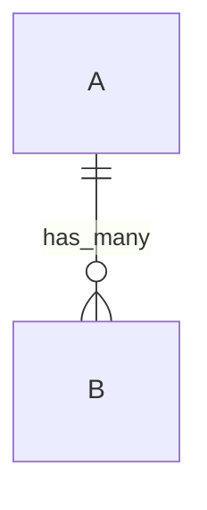

# 🌱 Blueprint v2 Template

```markdown
---
id: bp_{date}_{module}_{stt}
date: {YYYY-MM-DD}
module: "{module}"
type: "{schema | rule | feature | fix | deploy}"
status: "{draft | review | approved | done}"
seed_source: "CLAUDE.md > {section} | mindset.md > {section}"
---

# 🌱 BLUEPRINT: {tên}

> **Mô tả:** {1-2 câu}
> **Lý do:** {tại sao cần}
> **Seed DNA:** {trích dẫn từ seed}

---

## 1. DEBATE SUMMARY
| # | Topic | Proposal | Challenge | Resolution |
|---|-------|----------|-----------|------------|

## 2. SCHEMA
### 2.1 Collection / Table
```typescript
collection: "{name}" {
  id: string;
  // fields...
  createAt: Timestamp;
  updateAt: Timestamp;
}
```
### 2.2 Field Dictionary
| Field | Type | Required | Default | Ref | Validation | Mô tả |

## 3. SECURITY RULES
### 3.1 Firestore Rules
```javascript
match /{collection}/{id} {
  allow read: if ...;
  allow create: if ... && initFields([...]);
  allow update: if ...;
  allow delete: if ...;
}
```
### 3.2 Rules Rationale
- **read:** — vì ...
- **create:** — vì ...

## 4. INDEXES
### 4.1 Composite Indexes → JSON format
### 4.2 Query Pattern Mapping
| Index | Query Pattern | Cost Savings |

## 5. RELATIONS


## 6. DATA FLOW
### 6.1 Sequence Diagram
### 6.2 Read/Write Patterns
| Pattern | Type | Frequency | Index Used |

## 7. COST ANALYSIS
| Operation | Reads | Writes | Monthly Volume | Est. Cost |
**Tổng ước tính: ~$X/tháng**

## 8. IMPLEMENTATION PLAN
### 8.1 File Manifest
| # | Action | File | Pattern | Mục đích |
### 8.2 Build Order: Store → Hook → Trigger → UI

## 9. QUALITY CHECK
| Dimension | Status | Ghi chú |
| Security | ✅/❌ | |
| Cost (Zero-Cost) | ✅/❌ | |
| Performance | ✅/❌ | |
| UX | ✅/❌ | |
| Code Quality | ✅/❌ | |
| Architecture | ✅/❌ | |
| Reliability | ✅/❌ | |

## 10. QUESTIONS & DEBATES
| # | Question | Status | Resolution |
```
